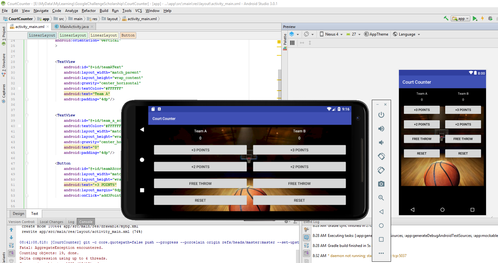
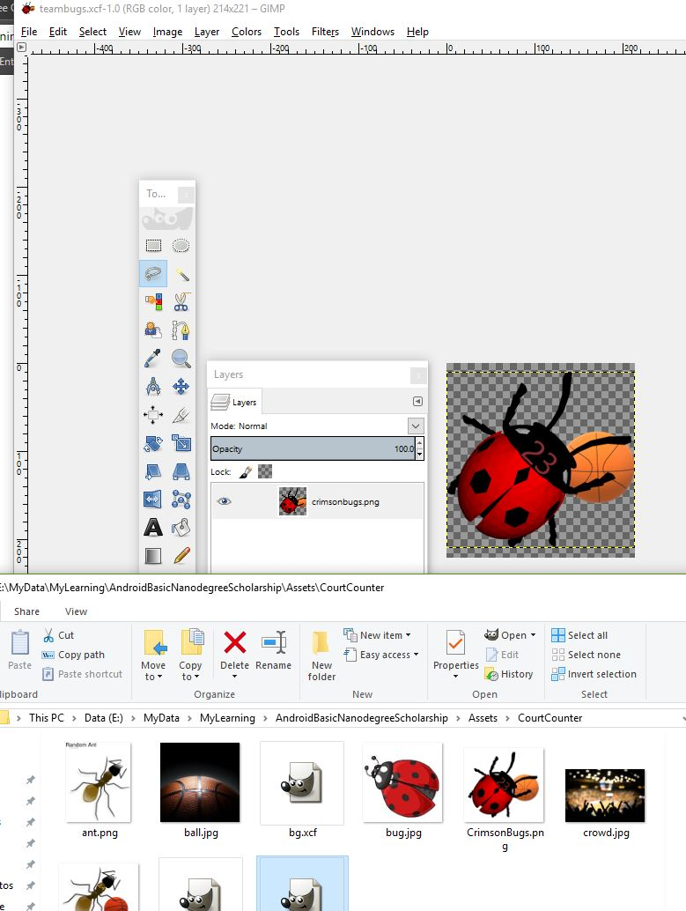

# ABNProject2
This project is for the Android Basic Nanodegree course at Udacity. Along with Google, they offer students to complete various projects in order to showcase and enhance what they are learning. 

## Versioning
Screen Capture of original app that I created while on following the lectures prior to implementation

## Media royalty-free 

## Screen Recording of the resulting app

